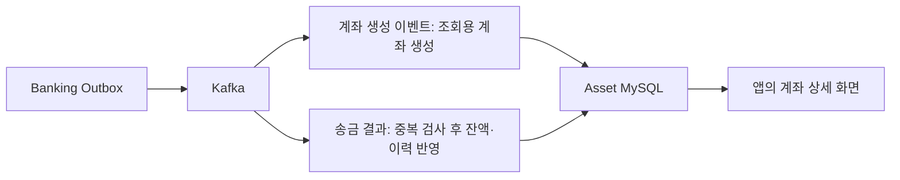
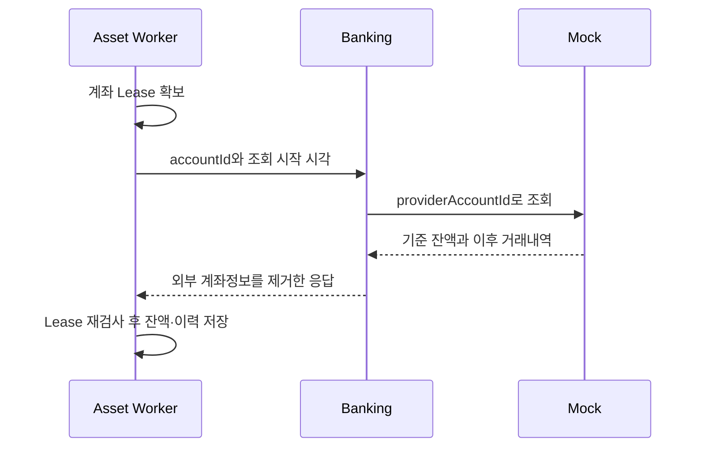

# Asset: 잔액과 거래내역을 믿고 볼 수 있게 만들기

Asset은 **사용자에게 보여 줄 잔액·거래내역과 하루 생활비 안내값**을 관리합니다. 실제 돈을 움직이거나 송금을 승인하지 않습니다. 원본에서 가져와 조회하기 좋게 만든 데이터를 Projection(조회용 데이터)이라고 부릅니다.

## 1. 계좌와 송금 결과를 받습니다



### Step 1. 같은 accountId로 계좌를 만듭니다

`BankingAccountEventConsumer`는 AccountCreated의 accountId를 Asset 계좌 PK로 사용합니다. 새 계좌에는 `SYNC_REQUIRED`를 표시합니다. 이벤트가 도착하기 전에 외부 입출금이 발생했을 수 있으므로 초기 잔액을 한 번 확인하기 위해서입니다.

코드: [BankingAccountEventConsumer](/C:/moaje/moaje-asset/src/main/kotlin/com/moaje/asset/account/messaging/consumer/BankingAccountEventConsumer.kt).

### Step 2. 같은 메시지와 같은 거래를 각각 검사합니다

송금 1만 원의 완료 알림을 두 번 받았다고 2만 원을 빼면 안 됩니다. Asset은 다음 두 가지를 봅니다.

| 검사 | 저장 기준 | 막는 중복 |
|---|---|---|
| 메시지를 이미 읽었나? | processed_event의 eventId PK | 같은 Outbox의 재전달 |
| 같은 금융 효과를 이미 반영했나? | transaction_history의 transferId + accountId + balanceChangeType Unique | 다른 eventId로 재발행한 같은 송금 |

```kotlin
if (processedEventRepository.existsById(command.eventId)) {
    return
}
```

위 검사만으로 끝내지 않습니다. 계좌 행을 잠근 뒤 중복을 다시 확인하고, 출금·입금 종류까지 검사합니다. **계좌 락**은 계산 중 다른 요청이 같은 잔액을 덮지 못하도록 하는 짧은 작업 순서표입니다. 예를 들어 서로 다른 두 출금이 동시에 와도 앞선 출금 이후 잔액에서 다음 출금을 계산합니다.

잔액 변경·거래내역·처리한 eventId는 하나의 DB 트랜잭션입니다. 실패하면 함께 취소됩니다. 실패 이벤트는 잔액을 바꾸지 않고 숨김 거래내역만 남깁니다.

코드: [TransferApplicationService.applyBankingTransferCompleted/applyBankingTransferFailed](/C:/moaje/moaje-asset/src/main/kotlin/com/moaje/asset/transfer/application/service/TransferApplicationService.kt).

**현재 Banking 완료 이벤트는 출금 효과만 보냅니다.** 수취 계좌의 입금과 앱 밖의 ATM 출금은 아래 정기 스냅샷 경로로 가져옵니다. 입금용 Kafka 계약까지 완성했다고 해석하면 안 됩니다.

## 2. 앱 밖의 거래와 누락을 확인합니다

스냅샷은 **같은 기준 시각의 잔액·계좌 상태·거래내역을 묶은 응답**입니다. Asset은 실제 계좌번호를 모르므로 Banking이 대신 Mock을 조회합니다.



### Step 1. 왜 정상 계좌도 조회하나요?

앱 안의 송금은 Kafka로 알 수 있지만 ATM 출금은 Banking에 요청한 거래가 아닙니다. 오류가 없다고 새 외부 거래도 없는 것은 아닙니다. 따라서 `SYNC_REQUIRED`, `STALE` 계좌뿐 아니라 마지막 검증 후 시간이 지난 `SYNCED` 계좌도 조회합니다.

현재 Compose 앱 프로필에서 자동 대사를 켜며, 기본 감사 간격 30초·Worker 확인 간격 5초·배치 20개입니다. 30초는 완료 SLA가 아닙니다. 계좌 수·응답 지연·재시도에 따라 1분 이상 걸릴 수 있습니다. 부하 측정값은 아직 없습니다.

### Step 2. 어디까지 읽었는지 별도로 기억합니다

```kotlin
lastEventAppliedAt // Kafka 이벤트를 반영한 시각
lastSyncedAt       // 마지막 정기 확인을 마친 시각
snapshotCursorAt   // 계정계 이력을 여기까지 조회했다는 경계
```

10시 외부 입금을 놓친 상태에서 10시 5분 송금 알림을 받았다고 조회 경계를 10시 5분으로 옮기면 입금을 영영 건너뜁니다. 그래서 이벤트는 cursor를 움직이지 않습니다. 첫 조회는 EPOCH부터, 다음 조회는 마지막 cursor부터 **경계 거래를 포함해서** 받습니다. 겹친 거래는 외부 거래 ID로 제거합니다.

### Step 3. 잔액과 이력을 다른 방식으로 맞춥니다

```kotlin
account.replaceProjection(snapshot.balance, snapshot.accountStatus)
snapshot.transactions.forEach { importSnapshotTransaction(account, it) }
```

스냅샷 잔액 8,500원에는 출금이 이미 포함되어 있습니다. 잔액은 8,500원으로 교체하고, 누락 이력만 추가합니다. 이력을 추가하며 다시 500원을 빼지 않습니다. 합계가 적힌 정산서와 상세 내역을 옮길 때 상세 금액을 합계에 또 더하지 않는 것과 같습니다.

스냅샷이 거래 X를 먼저 저장했다면 늦게 온 Completed(T, X)는 **기존 이력에 Banking 거래 T를 연결**합니다. 새 이력을 만들거나 재차 차감하지 않습니다. 외부 ID가 같아도 계좌·금액·방향이 다르면 자동 연결하지 않습니다.

### Step 4. 조회 중 새 이벤트가 오면 오래된 응답을 버립니다

Worker가 조회하는 동안 이벤트가 잔액을 바꾸면 `recordEventApplied()`가 기존 Lease를 취소합니다. Worker는 DB 락을 얻은 뒤 자신의 Lease와 만료 시각을 재확인합니다. 권한이 사라졌으면 늦은 스냅샷으로 최신 잔액을 덮지 않습니다.

원격 조회 중에는 DB 트랜잭션을 열지 않습니다. 최종 반영 시 계좌 락 안에서 잔액·이력·Work Outbox·동기화 상태를 함께 저장합니다. 실패는 다음 시각과 횟수를 기록하고 기본 10회 소진 후 `syncRetryExhausted`로 남깁니다.

이미 알고 있는 미확정 transferId는 Banking Journal도 조회합니다. 성공이면 출금 이력을 확정하고, 실패면 잔액을 바꾸지 않고 숨김 실패로, 이미 끝난 반전이면 원 출금과 반전 효과를 함께 복구합니다. 아직 UNKNOWN이거나 사용자·금액·통화가 맞지 않으면 추측해 확정하지 않습니다. 이 표적 조회와 계좌 스냅샷을 함께 사용해야 거래 상태와 기준 잔액을 모두 맞출 수 있습니다.

최대 두 번의 순차 gRPC 호출을 고려해 `Lease > 2 × gRPC deadline + 안전 여유`를 시작 시 검사합니다. 기본은 30초 > 2 × 5초 + 5초입니다. `asset.reconciliation.projection.*` 지표는 대기·잠긴 계좌·소진·복구 성공/실패·복구 효과 수를 보여 줍니다. 사용자·계좌 ID는 tag로 쓰지 않습니다.

코드: [Account](/C:/moaje/moaje-asset/src/main/kotlin/com/moaje/asset/account/domain/Account.kt), [AssetProjectionReconciliationService](/C:/moaje/moaje-asset/src/main/kotlin/com/moaje/asset/account/application/reconciliation/AssetProjectionReconciliationService.kt), [TransferApplicationService.applyAccountSnapshot/linkImportedEffect](/C:/moaje/moaje-asset/src/main/kotlin/com/moaje/asset/transfer/application/service/TransferApplicationService.kt).

## 3. Consumer 오류와 DLT

DLT(Dead Letter Topic)는 **계속 처리할 수 없는 메시지를 원인과 함께 보관하는 Kafka 토픽**입니다. Banking이 Kafka에 보내기 전 실패한 Outbox와는 다른 위치입니다.

```text
Asset DB 일시 오류 → 같은 파티션에서 1초 간격 최대 3회 재시도
깨진 Protobuf → 재시도 없이 DLT 처리
계속 실패 → 원본Topic.DLT → 기존 계좌 SYNC_REQUIRED → 스냅샷 복구
```

`DefaultErrorHandler`와 `DeadLetterPublishingRecoverer`가 담당합니다. `setFailIfSendResultIsError(true)`이므로 DLT 발행 확인 전에 원본 처리를 완료하지 않습니다. DLT 발행 후 표시 작업이 실패하면 재처리 과정에서 DLT가 중복될 가능성도 있습니다. DLT 자체가 정확히 한 번 적재된다는 보장은 아닙니다.

본문이 깨져 transferId를 못 읽으면 Kafka Header의 `moaje-account-id`로 **이미 존재하는 계좌**를 찾습니다. DLT 표식은 cursor를 초기화해 과거 이력도 다시 확인하도록 합니다. Header도 없으면 계좌를 추측하지 않습니다. 정기 감사는 기존 계좌의 잔액 차이를 찾지만, 생성 이벤트가 깨져 Asset 계좌 자체가 없는 경우는 찾지 못합니다. 원본 수정·재투입이 필요합니다.

코드: [AssetKafkaConsumerConfig](/C:/moaje/moaje-asset/src/main/kotlin/com/moaje/asset/transfer/messaging/consumer/AssetKafkaConsumerConfig.kt), [DltProjectionRecoveryMarker](/C:/moaje/moaje-asset/src/main/kotlin/com/moaje/asset/transfer/messaging/consumer/DltProjectionRecoveryMarker.kt). 운영자 재투입 API·DLT 알림·미처리 건수 관리와 세밀한 오류 분류는 미완료입니다.

## 4. 이미 끝난 반전은 기록만 정확히 맞춥니다

현재 모아제가 보상 실행을 승인하거나 요청하지는 않습니다. Banking 대사가 이미 REVERSED인 결과를 찾으면 원 출금 Completed와 반전 Reversed를 함께 복구합니다.

원 출금 전에 Reversed가 오면 바로 입금하지 않고 PENDING으로 기다립니다. 그렇지 않으면 출금도 안 된 화면 잔액에 돈이 더해집니다. Completed가 오면 같은 계좌 락 안에서 두 이력을 완결합니다. 원 출금 기록을 지우지 않습니다. 스냅샷과 겹쳐도 같은 외부 거래/금융 효과를 두 번 계산하지 않습니다. **반전은 Work 성공 이벤트에서 제외합니다.**

## 5. 화면 API와 하루 생활비

HTTP 사용자 ID는 Principal만 사용합니다. 본문·Query의 userId로 소유권이 바뀌지 않습니다.

| API | 입력 | 응답 |
|---|---|---|
| GET `/api/v1/assets/accounts/{accountId}/detail` | accountId: Long | 잔액, syncStatus, refreshing/refreshFailed, lastSyncedAt, visibleToUser 거래내역 |
| POST `/api/v1/assets/cashflow/daily-limit` | daysUntilNextPayday: 양수 Int; expectedIncome/fixedExpenses/eventBuffer: 0 이상, 기본 0; snapshotDate: 기본 오늘; forceRefresh: 기본 false | 사용자·현재 잔액·입력값·dailyLimit·기준일 |

계좌 표시는 현재 `ACCOUNT-계좌ID` 임시 문자열입니다. 실제 마스킹 계좌번호 제공 기능은 아닙니다. 상세 거래내역에는 publicTransactionId, type, amount, targetAccountId, status, createdAt 등이 있습니다.

```text
(활성 계좌 잔액 합계 + 예상 수입 - 고정 지출 - 남겨 둘 금액)
                       / 다음 수입일까지 남은 일수
```

`daysUntilNextPayday`는 **호출자가 REST/gRPC 요청으로 넣습니다.** Asset이 급여일을 조회하거나 스스로 일수를 계산하지 않습니다. 결과는 소수점 4자리, DOWN 방식이며 음수 결과를 0으로 보정하지 않습니다. 조회용 생활비 안내값이지 은행의 출금 한도가 아닙니다.

계산은 MySQL `daily_cashflow_snapshot`과 Redis 1일 캐시를 사용합니다. 현재 캐시 키는 사용자이며 같은 기준일이면 입력이 바뀌어도 예전 결과를 반환할 수 있습니다. 잔액 변경으로도 즉시 무효화되지 않습니다. 재계산은 `forceRefresh=true`를 사용하고, 입력별 캐시·무효화 개선은 별도 과제입니다.

코드: [DailyCashflowApplicationService](/C:/moaje/moaje-asset/src/main/kotlin/com/moaje/asset/cashflow/application/service/DailyCashflowApplicationService.kt). gRPC `AssetService.GetDailyCashflow`도 같은 Use Case를 호출하며 [asset_service.proto](/C:/moaje/moaje-grpc-contracts/proto/grpc/asset_service.proto)의 user_id는 서비스 간 인가 계약이 추가로 필요합니다.

## 6. Work에는 날짜를 바꾸지 않고 보냅니다

스냅샷에서 원 거래 시각을 확인한 성공만 `transaction_succeeded_events`로 보냅니다. 빠른 잔액 반영은 Kafka로 유지하지만 Work 전달은 다음 대사까지 기다릴 수 있습니다.

| 필드 | 의미 |
|---|---|
| occurred_at | 원 거래 발생 시각. 통계 날짜의 기준 후보 |
| succeeded_at | 계정계 확정 시각. 구버전 이력에서 없으면 빈 값 |
| recovered_at | 대사로 누락·외부 거래를 발견한 시각 |
| recorded_at | Asset이 이번 이벤트를 만든 시각 |
| external_type / timestamp_source | 원 입출금 유형 / 새 이벤트는 CORE_BANKING |
| snapshot_balance / snapshot_as_of | 조회 시점의 잔액·기준 시각. 과거 거래 직후 잔액이 아님 |

거래마다 `work_event_recorded`로 Outbox 중복 생성을 막습니다. 기존 반전·원시각 미확인 Outbox는 `delivery_excluded`로 보존하며 발행 성공이라고 표시하지 않습니다. 이미 전달한 구버전 통계를 고치는 기능은 없습니다.

코드: [AssetOutboxKafkaPublisher](/C:/moaje/moaje-asset/src/main/kotlin/com/moaje/asset/transfer/messaging/publisher/AssetOutboxKafkaPublisher.kt). **이 Publisher는 Banking Publisher와 다릅니다.** 아직 DB 트랜잭션 안에서 Kafka 확인을 기다리며 Lease·제한 재시도가 없습니다. Work 소비 중복 방지·시간대·카테고리·RPC 인증은 Work와 합의 후 개발합니다.

## 7. 저장·테스트·한계

핵심 테이블은 `account`, `transaction_history`, `processed_event`, `transactional_outbox`, `daily_cashflow_snapshot`입니다. MySQL 마이그레이션 V1~V3와 H2용 파일을 함께 관리합니다. [실행·Flyway 안내](infra.md)를 먼저 확인하세요.

테스트: `TransferApplicationServiceIdempotencyJpaTest`는 같은 eventId/다른 eventId·동시 소비·반전 순서를, `AssetProjectionReconciliationServiceJpaTest`는 Lease·스냅샷 경합을, `AssetWorkEventPolicyTest`는 날짜와 반전 제외를 검사합니다. 현재 실행 근거는 [검증 기록](../phase-history-and-retrospective.md#verification)에 있습니다.

직접 만든 `AssetKafkaConsumerConfig`의 Listener Factory에도 `spring.kafka.listener.auto-startup`을 전달합니다. 테스트에서 false를 설정했는데 실제 Kafka 소비가 시작되는 일을 막기 위해서입니다. `AssetKafkaConsumerConfigTest.respectsDisabledAutoStartup`은 컨테이너가 자동 시작되지 않는지 검사하며 실제 브로커에 연결하지 않습니다.

남은 한계: 대량 이력 페이지 처리, 이력이 삭제된 뒤 완전 재구성, cursor 이전의 조용한 누락·잘못 추가된 이력 삭제, 계좌 생성 DLT 복구, 운영자 소진 상태 해제 API. 지표 코드는 있어도 모든 요청 지표와 운영 알림이 완성된 것은 아닙니다.

직접 설명해 볼 질문: **왜 스냅샷 잔액을 넣은 뒤 이력 금액을 다시 더하지 않나요? eventId가 바뀐 같은 송금은 무엇으로 구별하나요?** 답은 1~2절의 서로 다른 중복 검사와 잔액 교체 방식입니다.
