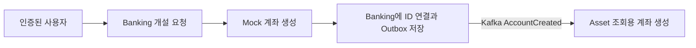
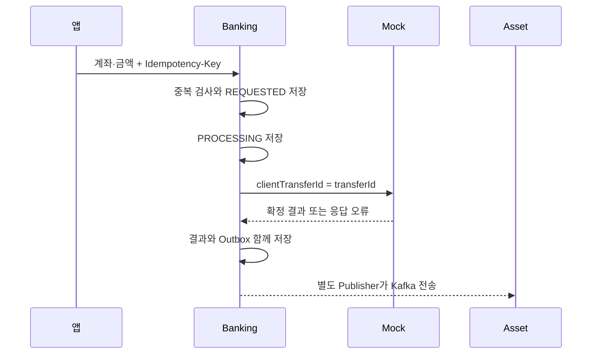

# Banking: 요청을 맡고 결과를 끝까지 기록하기

Banking은 **돈을 보관하는 은행이 아니라, 은행에 업무를 요청하는 창구**입니다. 실제 잔액은 Mock Banking이 바꿉니다. Banking은 누가 어떤 요청을 했고 어디까지 처리됐는지를 저장합니다. 이 문서는 현재 코드 기준이며, 과거 변경 순서는 [개발 기록](../phase-history-and-retrospective.md)을 봅니다.

## 1. 계좌 개설과 계좌 ID



1. Controller가 Principal의 사용자 ID를 가져옵니다. 본문의 `userId`는 계좌 소유자를 정하지 못합니다.
2. Mock이 계좌를 만들고 `providerAccountId`를 반환합니다.
3. Banking은 자신이 발급한 `accountId`와 이 값을 `banking_account`에 연결합니다. 연결표와 계좌 생성 이벤트는 같은 DB 트랜잭션에 저장합니다.
4. Asset은 이벤트의 `accountId`를 그대로 사용합니다. 실제 계좌번호나 `providerAccountId`를 받을 필요가 없습니다.

계좌 ID는 주소록의 연락처 번호와 비슷합니다. 앱은 내부 연락처 번호인 `accountId`로 요청하고, Banking만 외부기관이 알아듣는 `providerAccountId`로 바꿉니다. 둘은 실제 계좌번호가 아닙니다.

코드: [AccountOpeningServiceImpl.open](/C:/moaje/moaje-banking/src/main/kotlin/com/moaje/banking/application/service/impl/AccountOpeningServiceImpl.kt), [BankingAccount](/C:/moaje/moaje-banking/src/main/kotlin/com/moaje/banking/domain/account/BankingAccount.kt).

**한계:** 계좌 개설에는 송금과 같은 접수 Journal·Idempotency-Key 정책이 없습니다. Mock 개설 성공 직후 Banking 저장이 실패하는 구간과 동시 개설 경쟁은 별도 과제입니다. CI·이름·전화번호도 아직 본문으로 받으며 Auth와 공급 계약을 정해야 합니다.

## 2. 송금 한 건을 따라가기



### Step 1. 같은 송금을 다시 접수하지 않습니다

`Idempotency-Key`는 **재접수 때 보여 주는 접수번호**입니다. 한 번 송금하려는 동안 같은 키를 유지하고, 의도적으로 두 번째 송금을 할 때는 새 키를 만듭니다.

```kotlin
val requestHash = TransferRequestHash.from(command)
val decision = getOrCreateTransfer(command, requestHash)
if (decision.existing) {
    return decision.transfer.toResult()
}
```

같은 사용자·업무·키에 내용까지 같으면 기존 결과를 반환합니다. 아직 처리 중이어도 Mock을 다시 부르지 않습니다. 금액이나 수취계좌가 바뀌면 409입니다. 동시에 요청해도 DB의 `(principal_id, operation_type, idempotency_key)` Unique 제약이 마지막 방어선입니다. 저장 충돌 후에는 새 트랜잭션에서 승자의 거래를 조회합니다.

`requestHash`는 요청 비교값이지 암호화된 계좌번호가 아닙니다. 현재 SHA-256 대상은 고정 순서의 `operationType`, `withdrawalAccountId`, `depositBankCode`, `depositAccountNumber`, `amount`, `currency`입니다. 각 줄을 `필드명=값`으로 만들고 줄바꿈으로 연결해 UTF-8로 해시합니다. 은행코드·통화는 trim과 대문자 변환, 수취계좌는 trim, 금액은 불필요한 뒤쪽 0을 제거합니다. CI·이름·전화번호·생성시각은 제외합니다.

코드: [TransferRequestHash.from](/C:/moaje/moaje-banking/src/main/kotlin/com/moaje/banking/domain/transfer/TransferRequestHash.kt). 이 정규화가 모든 입력의 유효성 검증을 대신하지는 않습니다. 개행 등 허용 문자와 DB 길이 제한을 Application에서도 일관되게 검사하는 보강은 남아 있습니다.

### Step 2. 새 요청만 실제 은행으로 보냅니다

```kotlin
val withdrawalProviderAccountId = account.providerAccountIdForTransfer(command.principalId.value)
```

Banking이 출금계좌의 소유자와 활성 상태를 검사합니다. 잔액 부족 검사는 Mock의 일입니다. `transferId`를 한 번 발급해 저장하고, 외부 DTO의 `clientTransferId`에 같은 값을 넣습니다. 별도 ID를 또 만들지 않습니다.

DB 트랜잭션은 **함께 저장되거나 함께 취소되는 변경 묶음**입니다. 원격 응답 대기까지 이 묶음에 넣으면 DB 연결을 오래 붙잡으므로 다음처럼 나눕니다.

| 순서 | DB 트랜잭션 | 하는 일 |
|---|---|---|
| 1 | 짧게 시작·종료 | 멱등성·소유권 검사, REQUESTED 저장 |
| 2 | 새로 시작·종료 | PROCESSING 저장 |
| 3 | 없음 | Mock REST 호출 |
| 4 | 새로 시작·종료 | 결과 상태 + 감사 로그 + Outbox 저장 |

코드: [TransferCommandServiceImpl.request/getOrCreateTransfer/saveResult](/C:/moaje/moaje-banking/src/main/kotlin/com/moaje/banking/application/service/impl/TransferCommandServiceImpl.kt).

### Step 3. 송금 성공과 메시지 전달 성공을 구분합니다

Outbox는 DB 안의 **발송 대기함**입니다. 송금 결과와 같이 저장하므로 Kafka가 꺼져 있어도 보낼 내용은 남습니다. `BankingTransferEventPublisher`라는 이름이지만 실제 역할은 Kafka 직접 전송이 아니라 Outbox 저장입니다.

```text
짧은 DB 작업: PENDING 이벤트의 Lease 확보
DB 작업 밖: Kafka 전송과 수신 확인 대기
짧은 DB 작업: PUBLISHED 또는 실패 횟수·다음 시각 저장
```

Lease는 만료되는 작업 권한입니다. `lockedAt/lockedUntil/lockOwner`로 다른 Worker의 선점을 막고, 담당 서버가 죽으면 만료 후 다른 Worker가 이어받습니다. 재시도는 같은 `eventId`를 사용합니다. 자동 재시도 소진은 `RETRY_EXHAUSTED`이며 금융거래 실패가 아닙니다.

Kafka가 받은 직후 Banking이 종료되면 DB에는 PENDING이 남아 중복 발행할 수 있습니다. 그래서 [Asset의 중복 검사](asset.md)가 함께 필요합니다. Lease를 넘도록 멈춘 프로세스까지 물리적인 중복 전송을 절대 차단하는 구조는 아닙니다.

코드: [BankingOutboxPublisher](/C:/moaje/moaje-banking/src/main/kotlin/com/moaje/banking/application/outbox/BankingOutboxPublisher.kt), [BankingOutboxMaintenanceService](/C:/moaje/moaje-banking/src/main/kotlin/com/moaje/banking/application/outbox/BankingOutboxMaintenanceService.kt). 커밋 직후 빠른 발행 경로와 주기적 조회가 같은 Publisher를 사용합니다. 수동 재발행 메서드는 있으나 운영자 HTTP API는 없습니다.

## 3. 결과를 모를 때 다시 확인하기

대사(Reconciliation)는 **원본과 내 기록을 맞춰 보는 작업**입니다. Timeout은 “송금 실패”가 아니라 “답을 못 들음”입니다. 다시 송금하거나 즉시 취소하지 않고 원 `transferId`의 결과를 조회합니다.

| Banking DB 상태 | 의미·다음 처리 |
|---|---|
| REQUESTED | 접수 저장. 여기서 서버가 죽으면 현재 Worker가 자동 복구하지 못함 |
| PROCESSING | 호출 진행 중. `processingStartedAt`이 stale 기준보다 오래됐을 때만 대사 |
| UNKNOWN | 결과 불명. 대사 대상 |
| SUCCEEDED / FAILED | 확인된 결과. 현재 정기 대사 대상에서 제외 |
| REVERSED | 대사 중 이미 완료된 반전을 확인한 상태. 모아제가 반전을 실행한 것은 아님 |

`stale`은 “마지막 진행 기록이 너무 오래됨”이라는 뜻입니다. 정상 PROCESSING을 건드리지 않도록 기본 120초를 기다립니다. 시작 시 `120초 > 연결 3초 + 응답 대기 30초 + 여유 30초`를 검증합니다. 전화에 비유하면 connectTimeout은 연결 대기, readTimeout은 연결 후 답변 대기입니다. 예외 처리는 기다림이 끝난 뒤의 행동이고 Timeout 설정은 언제 기다림을 끝낼지를 정합니다.

**120초가 살아 있는 모든 요청을 절대로 배제하는 증명은 아닙니다.** 긴 JVM 정지, 여러 외부 호출, 네트워크·DB 지연을 관찰해 조정해야 합니다. 현재 작은 JSON 응답을 전제로 한 개발 기본값입니다.

Worker는 짧은 DB 작업으로 Lease를 얻고, DB 밖에서 Mock을 조회하고, 다시 DB를 잠가 소유권과 상태를 확인해 결과·Outbox를 저장합니다. 조회 실패는 backoff(다음 시도를 늦추는 간격)와 횟수를 기록합니다. 기본 10회 소진 후 자동 처리에서 제외합니다. UNKNOWN·잠긴 대상·소진 대상과 복구 성공/실패는 `banking.reconciliation.transfer.*` 지표로 확인합니다.

코드: [TransferReconciliationService](/C:/moaje/moaje-banking/src/main/kotlin/com/moaje/banking/application/reconciliation/TransferReconciliationService.kt), [TransferProcessingTimingPolicy](/C:/moaje/moaje-banking/src/main/kotlin/com/moaje/banking/application/reconciliation/TransferProcessingTimingPolicy.kt).

Mock의 NOT_FOUND를 FAILED로 처리하는 현재 정책에는 전제가 있습니다. 조회 오류를 “없음”으로 숨기지 않아야 하고, 삭제된 과거 성공이나 아직 실행 가능한 지연 요청을 구별할 수 있어야 합니다. **강한 일관성 조회만으로 나중에 실행될 요청까지 없다고 증명하지는 못합니다.** 보존·지연 요청 종료 계약은 운영 전 보강 항목입니다.

## 4. API와 저장 규격

HTTP는 Gateway를 거칩니다. 앱 JWT의 검증된 `sub`가 내부 헤더를 통해 Principal이 됩니다. 서비스 포트에 헤더를 직접 넣는 방식은 공개 API가 아닙니다.

| API | 입력 | 반환·주의 |
|---|---|---|
| POST `/api/v1/banking/accounts` | ci, userName, phoneNumber, bankCode, productName: 비어 있지 않은 문자열; initialBalance: 0 이상 Long | 201. accountId, userId, bankCode, productName, balance, status, createdAt, canceledAt |
| POST `/api/v1/banking/transfers` | Idempotency-Key 필수. withdrawalAccountId: 양수 Long; depositBankCode/Number: 필수; amount: 양수 Long; currency: 기본 KRW | 200. transferId, publicTransferId, status, message, externalTransactionId |

**REST 성공 상태는 `COMPLETED`, DB 성공 상태는 `SUCCEEDED`입니다.** DB의 REQUESTED·PROCESSING·UNKNOWN은 현재 REST에서 모두 PROCESSING으로 매핑됩니다. 200만 보고 송금 성공으로 판단하지 마세요. 인증 없음 401, 키 누락 400, 동일 키·다른 요청 409입니다. JS 클라이언트는 Long ID를 일반 Number로 읽으면 정밀도를 잃을 수 있으므로 문자열 계약 또는 lossless 파서를 협의해야 합니다.

gRPC 9091은 mTLS(서로 인증서를 확인하는 연결)를 사용합니다. [banking_service.proto](/C:/moaje/moaje-grpc-contracts/proto/grpc/banking_service.proto)가 계약 원본입니다.

| RPC | 요청 | 응답 |
|---|---|---|
| GetTransferProjectionStates | account_id, transfer_ids | 사용자·계좌·금액·상태·원/반전 외부 ID·실패 사유 |
| GetAccountProjectionSnapshot | account_id, cursor_epoch_millis | 기준 잔액·계좌 상태·as_of·외부 거래의 ID/유형/금액/원 발생·완료 시각 |

Kafka는 Protobuf 바이트를 사용합니다. `account_created_events`, `moaje.banking.transfer-completed`, `moaje.banking.transfer-failed`, `moaje.banking.transfer-reversed`를 발행합니다. 송금 메시지 key는 accountId이며 서로 다른 Topic 사이의 순서는 보장되지 않습니다. 원 계좌번호·providerAccountId는 넣지 않습니다.

| 주요 테이블 | 저장 목적 |
|---|---|
| banking_account | 내부 계좌와 외부 계좌 ID 연결·소유자·상태 |
| banking_transfer | 송금 접수·멱등성·결과·대사·version |
| banking_outbox | event_id 단일 PK, payload, 전달 상태·Lease·재시도 |
| kftc_api_log | 축약된 호출 감사 기록. 생명주기 기준 테이블이 아님 |
| bank_routing_status / reconciliation_history | 기존 상태·이력 모델. 존재 자체가 전체 운영 기능 완성을 뜻하지 않음 |

## 5. 테스트와 남은 일

각 모듈에서 `./gradlew.bat test --rerun`. Banking 핵심 근거는 `TransferCommandServiceIdempotencyTest`, `BankingOutboxPublisherTest`, `TransferReconciliationServiceTest`, `AccountOpeningServiceOutboxJpaTest`, `BankingGrpcServerMutualTlsTest`입니다. 호출 횟수·DB 건수·상태·이벤트 ID·Lease를 함께 검사합니다. 실제 실행 결과는 [검증 기록](../phase-history-and-retrospective.md#verification)에만 모읍니다.

아직 남은 일: REQUESTED 자동 복구, 송금 요청 5xx/일부 통신 오류의 UNKNOWN 분류 보강, 외부 토큰 획득 실패 경계, 계좌 개설 정합성, 운영자 재처리 권한·감사, 수취계좌 보관 정책. Banking 대사 스케줄러는 현재 기본 및 기본 Compose에서 비활성입니다. 구현과 활성화를 구분하세요.

MySQL에서 Outbox 본문 타입은 V1의 `BLOB`입니다. `BankingOutboxEvent.payload`에도 이를 명시해 Hibernate의 기본 `TINYBLOB` 기대값과 충돌하지 않게 했습니다. `BankingOutboxPayloadJpaTest`의 1KB 왕복 검사와 실제 Compose 시작·발행 검사로 나누어 확인합니다. 또한 생성 시각 `LocalDateTime`과 재시도 시각 `Instant`는 DB 표현이 다르므로 SQL에서 그대로 비교하지 않습니다. 시간 타입·저장 시간대 통일은 별도 변경으로 검토합니다.

직접 설명해 볼 질문: **Outbox로 해결되는 장애와 결과 조회가 필요한 장애는 각각 무엇인가요? 왜 같은 키 요청에는 Mock을 다시 부르지 않나요?** 답은 2절의 트랜잭션 사이와 3절의 원거래 조회에 있습니다.
