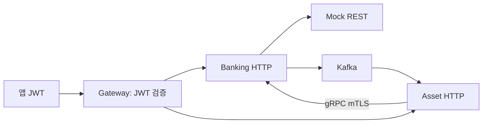

# Infra: 네 모듈을 연결하고 실행하기

`moaje-infra`는 Gateway와 공통 실행 환경을 관리합니다. 실제 Mock 저장소는 `backing-mockup`입니다. 두 Compose를 사용하되 Mock의 기존 전용 Redis 데이터를 infra Redis와 합치지 않습니다.

## 1. 요청과 데이터가 지나가는 길



Gateway는 검증된 사용자를 전달하는 입구입니다. MySQL은 각 서비스의 기록, Kafka는 서비스 사이 메시지, Redis는 캐시 등에 사용합니다. Mock은 별도의 Redis에 실제 계좌·거래를 저장합니다.

## 2. JWT가 Principal이 되기까지

1. Auth가 JWT를 발급하고 앱이 보관합니다. 이 Auth 구현은 이번 네 모듈 작업에 포함되지 않습니다.
2. 앱이 `Authorization: Bearer ...`를 보냅니다.
3. `GatewayGuardFilter`가 외부에서 넣은 내부 사용자 헤더를 제거합니다.
4. `GatewayJwtFilter`가 서명·issuer·audience·만료·sub 등을 검증합니다.
5. 검증된 `sub`만 `X-Authenticated-User-Id`로 붙여 라우팅합니다.
6. Banking·Asset의 `GatewayPrincipalFilter`가 이를 Controller의 Principal로 바꿉니다. 본문 userId로 대신하지 않습니다.

이 헤더는 **Gateway를 통과했다는 확인 표식**이지 자체 서명된 신분증이 아닙니다. 그래서 서비스 HTTP 포트를 호스트에 공개하지 않습니다. 내부 네트워크의 악의적인 호출자까지 막으려면 서비스 JWT 재검증이나 HTTP mTLS가 더 필요합니다.

송금의 `Idempotency-Key`는 정확히 POST `/api/v1/banking/transfers`에서만 필수 검사합니다. 형식은 영문·숫자·`._:-` 1~100자입니다. 중복 요청을 Gateway가 삼키지 않고 Banking으로 전달해야 기존 송금 결과를 받을 수 있습니다. 로그인 등 전체 POST에 적용하지 않습니다.

코드: [GatewayJwtConfiguration](/C:/moaje/moaje-infra/moajeGateway/src/main/kotlin/com/moaje/moajegateway/config/GatewayJwtConfiguration.kt), [GatewayJwtFilter](/C:/moaje/moaje-infra/moajeGateway/src/main/kotlin/com/moaje/moajegateway/filter/GatewayJwtFilter.kt).

### Auth 회의 후 설정할 값

`.env.example`은 안내이며 실제 값은 Git에서 제외한 `.env`에 넣습니다. 아직 빈 설정은 인증 허용이 아닙니다. 토큰 누락·잘못된 토큰은 401, 검증 계약 미설정 상태에서 토큰을 제시하면 503입니다.

| 변수 | 무엇을 합의하나요? |
|---|---|
| AUTH_JWT_ISSUER | 발급자 이름. 토큰 iss와 정확히 같은 문자열 |
| AUTH_JWT_AUDIENCE | 이 API에 사용할 토큰인지 나타내는 aud |
| AUTH_JWT_JWK_SET_URI | 서명을 검사할 공개키 목록의 HTTPS 주소. 개인키가 아님 |
| AUTH_JWT_ALGORITHM | 허용할 서명 방식. 현재 RSA/ECDSA 계열 지원, 예: RS256 |
| AUTH_PUBLIC_ENDPOINTS | `POST /정확한/로그인/경로` 형식, 쉼표 구분. 와일드카드 미지원 |

JWT 필수 payload는 `sub`, `iss`, `aud`, `exp`입니다. sub는 영문·숫자·`._:@-` 1~100자의 안정적인 사용자 ID로 맞춥니다. Header의 alg·kid·typ 정책과 키 교체 주기도 회의에서 정합니다. CI·이름·전화번호를 JWT에 추가하지 않습니다. 로컬 테스트만 HTTP localhost JWKS를 허용하며 운영 HTTPS 인증서 검증을 끄지 않습니다.

### 라우팅

| 경로 | Compose 대상 |
|---|---|
| `/api/v1/banking/**` | banking:8080 |
| `/api/v1/assets/**` | asset:8082 |
| `/api/v1/auth/**` | host.docker.internal:8085, 현재 별도 실행 필요 |
| `/api/v1/work/**` | host.docker.internal:8084, 현재 별도 실행 필요 |

IDE에서는 Gateway 기본 Banking URI가 localhost:8083입니다. Banking 기본 8080과 다르며 Gateway도 8080을 사용하므로 실제 IDE 포트와 `BANKING_SERVICE_URI`를 함께 맞춰야 합니다. Docker 내부에서는 같은 8080을 서로 다른 컨테이너에서 사용해 충돌하지 않습니다.

## 3. 필요한 것만 실행합니다

새 개발 DB는 아래 명령으로 시작합니다. **기존 데이터가 있는 DB는 아래 Flyway 절을 먼저 읽으세요.** 이번 빈 DB 검증은 옛 데이터의 자동 전환을 보장하지 않습니다.

```powershell
# 1. C:\moaje\backing-mockup
docker compose up -d --build

# 2. C:\moaje\moaje-infra
docker compose --profile apps up -d --build
docker compose --profile apps ps -a
```

| 실행 옵션 | 켜지는 구성 |
|---|---|
| 옵션 없음 | Banking/Asset MySQL 2개, Redis, Kafka |
| --profile apps | 위 구성 + Banking, Asset, Gateway, gRPC 개발 인증서 초기화 |
| --profile tools | RedisInsight, Kafka UI 추가 |
| --profile monitoring | Prometheus, Grafana 추가 |

Grafana는 송금 필수 기능이 아니므로 기본 실행에서 제외했습니다. 장애 지표 코드는 유지합니다. 기존에 만들어진 선택 도구 컨테이너는 stopped 상태로 남아 있어도 정상이며 데이터 보존을 위해 삭제하지 않습니다.

필요할 때 `docker compose --profile tools up -d redisinsight kafka-ui` 또는 `docker compose --profile monitoring up -d prometheus grafana`로 켭니다. 이미 생성된 컨테이너는 Docker Desktop의 시작 버튼으로도 켤 수 있습니다. Grafana의 지표를 보려면 Prometheus도 켜야 합니다. 프로필은 **새로 시작할 서비스 선택**이며, 이미 켜진 도구를 자동으로 끄지는 않습니다.

Nginx 앞단 프록시와 그 HTTPS 인증서 초기화 구성은 제거했습니다. 현재는 로컬 Gateway HTTP로 충분합니다. 외부 공개 배포에서는 HTTPS 종료 지점을 다시 마련해야 합니다. 테스트 스크립트의 일회성 `jwks-fixture`는 공개키 제공용 서버로, 앞단 프록시와는 다릅니다.

모든 현재 Compose restart 정책은 `"no"`입니다. Docker가 켜졌다고 앱을 자동 재시작하지 않습니다. 이전 정책의 컨테이너에는 `up`으로 재생성하기 전까지 옛 설정이 남을 수 있습니다. Docker Desktop 자체의 OS 로그인 자동 실행 설정은 별개이며 변경하지 않았습니다. Gateway IDE 실행이 Compose를 자동 시작하던 의존성도 이전 보강에서 제거했습니다.

```powershell
# C:\moaje\moaje-infra, 볼륨을 보존하며 중지
docker compose --profile apps --profile tools --profile monitoring stop
# C:\moaje\backing-mockup
docker compose stop
```

| 접근 대상 | 호스트 주소 | 컨테이너 내부 |
|---|---|---|
| Gateway | 127.0.0.1:8080 | gateway:8080 |
| Mock API | 127.0.0.1:8081 | Banking은 host.docker.internal:8081 사용 |
| MySQL Asset / Banking | 127.0.0.1:3307 / :3308 | asset-mysql:3306 / banking-mysql:3306 |
| Redis infra / Mock | 127.0.0.1:6379 / :6380 | 각 Compose의 redis:6379 / mock-banking-redis:6379 |
| Kafka | 127.0.0.1:9092 | kafka:29092 |

MySQL·Redis·Kafka healthcheck는 저장소 준비를 기다리기 위한 것입니다. **컨테이너 Started는 애플리케이션 성공과 다릅니다.** 앱 로그의 Started, HTTP 응답, 실제 데이터 반영까지 확인합니다.

## 4. Banking과 Asset의 gRPC 인증서

gRPC는 서비스끼리 정해진 Protobuf 계약으로 함수를 호출하는 통신입니다. Asset은 Banking에 거래 상태와 계좌 스냅샷을 요청합니다. mTLS는 서버뿐 아니라 호출한 클라이언트도 인증서를 제시하는 방식입니다.

`grpc-cert-init`이 `certs/`에 개발용 CA와 각 서비스 인증서를 만듭니다. 각 컨테이너에는 자기 개인키만 마운트하고 상대를 검증할 CA를 공유합니다. 완성된 기존 인증서는 덮어쓰지 않습니다. 일부 파일만 남으면 실패하므로 키를 임의 삭제하지 말고 세트를 확인합니다.

Banking 서버 9091은 Asset 인증서를 요구합니다. Asset 서버 9090도 TLS 설정을 사용하지만 Auth·Work RPC 사용자 권한 계약까지 완성된 것은 아닙니다. 인증서는 개발용 365일이며 운영 발급·회전·폐기 절차가 별도로 필요합니다. 이 키는 **Auth JWT 서명키와 다릅니다.** `grpc-cert-init-1`은 볼륨이 아니라 초기화 후 종료되는 컨테이너입니다. 이 기능을 없애면 새 환경에서 mTLS 연결을 준비할 수 없어 유지합니다.

코드: [grpc/init-certs.sh](/C:/moaje/moaje-infra/grpc/init-certs.sh). 인증서 파일·`.env`·테스트 임시 키는 Git에 올리지 않습니다.

## 5. Flyway를 이해하고 DB를 바꾸기

Flyway는 **DB 변경 순서표를 실행하고 기록하는 도구**입니다. SQL을 작성할 필요가 사라지는 것이 아니라, 사람이 DBMS 도구에 따로 입력하던 SQL을 리뷰 가능한 파일로 남기고 같은 순서로 적용합니다. Entity 수정도 여전히 필요합니다.

```text
새 V번호__설명.sql 작성 + Entity 변경
→ 테스트 DB에 migration 실행
→ Hibernate validate로 코드·테이블 대응 확인
→ 검토 후 실제 DB에 같은 migration 실행
```

Banking은 MySQL V1~V5, Asset은 V1~V3입니다. 테스트 H2와 타입이 달라 `db/migration/{vendor}` 아래 별도 파일을 둡니다. 이미 적용한 SQL을 수정하지 말고 새 버전을 추가합니다. validate는 데이터 의미·모든 제약조건까지 증명하지 않습니다.

### 이번 실제 DB에서 실패한 이유

이전 설정의 `baseline-on-migrate=true`는 비어 있지 않은 DB를 버전 1로 간주할 수 있었습니다. **baseline은 기존 테이블을 V1 구조로 바꿔 주는 기능이 아닙니다.** 현재 기본값과 Compose는 `false`로 바꿔 모르는 구 DB를 자동 승인하지 않습니다.

기존 Banking DB에는 banking_transfer 자체가 없었고, Asset 계좌는 account_token을 쓰는 옛 구조였습니다. V1을 건너뛰고 V2를 실행해 양쪽 시작이 실패했습니다. Asset V2의 컬럼 추가는 실행됐지만 뒤의 인덱스 생성이 실패했습니다. MySQL DDL은 일부 적용이 남을 수 있습니다.

사용자는 격리 검증 성공 후 기존 **로컬 개발 데이터 초기화**를 승인했습니다. 데이터를 유지해야 하는 DB라면 백업·구 식별자 매핑·전환 SQL·복원 검증이 별도로 필요합니다. `repair`나 validate 해제로 대신하지 않습니다. 초기화와 데이터 보존 업그레이드는 다른 작업입니다.

빈 MySQL 검증에서는 추가로 Banking Outbox의 SQL `BLOB`과 Hibernate 기본 `TINYBLOB` 기대값이 달랐습니다. `BankingOutboxEvent.payload`에 `columnDefinition="BLOB"`을 명시해 기존 V1과 맞췄습니다. 적용된 SQL은 수정하지 않았습니다. `BankingOutboxPayloadJpaTest`는 1KB 본문 저장·조회, Compose는 실제 MySQL 타입 검증과 메시지 발행을 확인합니다.

## 6. 테스트와 운영 확인

단위 테스트는 각 프로젝트에서 `./gradlew.bat test --rerun`으로 실행합니다. Mock Lua 통합 테스트는 Mock Redis를 켜고 `MOCK_REDIS_TEST_PORT=6380`을 지정해 `redisIntegrationTest --rerun`으로 실행합니다.

준비한 [compose-smoke.ps1](/C:/moaje/moaje-infra/tests/compose-smoke.ps1)은 계좌 개설·JWT 사용자 전달·송금 재요청·충돌·실제 출금 1회·Asset 반영·외부 출금 발견을 검사합니다. `-KafkaOutage`는 테스트 환경의 Kafka를 잠시 중지해 Outbox 보존·복구를 검사합니다. 실행 중 거래가 발생하고 시험 이력이 남으므로 운영 데이터 환경에서 실행하지 않습니다.

이 스크립트는 테스트 RSA 개인키를 메모리에서 생성하고 공개 JWKS만 `.local/smoke`에 씁니다. 별도 Compose override로 테스트 동안 Gateway 검증 계약을 적용하고 finally에서 기본값으로 복원합니다. 실제 Auth 연동 검증을 대신하지 않습니다.

격리 실행은 다음과 같습니다. `moaje-verify`와 `moaje-mock-verify` 프로젝트는 별도 볼륨·포트·인증서를 사용합니다. Gateway는 18080, Mock은 18081입니다. 선택 도구는 이 환경에서 실행하지 않습니다.

```powershell
# C:\moaje\backing-mockup
docker compose -p moaje-mock-verify --env-file C:\moaje\moaje-infra\tests\verify.env up -d --build
# C:\moaje\moaje-infra
docker compose -p moaje-verify --env-file tests/verify.env --profile apps up -d --build
.\tests\compose-smoke.ps1 -Verify -KafkaOutage
```

결과는 `.local/verify-smoke/result.json`에 저장합니다. 테스트용 계좌·거래는 검사할 수 있도록 해당 DB에 남습니다. `down -v`나 `volume prune`으로 무관한 개발 데이터를 함께 지우지 않습니다.

지표 조회·로그 예:

```powershell
docker compose --profile apps logs --tail 100 banking asset gateway
docker compose exec kafka kafka-topics --bootstrap-server kafka:29092 --list
```

Gateway Actuator health/metrics/prometheus는 로컬 포트에서 확인합니다. Nginx 차단 계층은 이제 없으므로 외부 공개 시 관리 경로 접근 제어가 필요합니다. Banking·Asset에는 대사 지표 코드가 있습니다. 모든 업무 지표와 DLT 미처리 수·알림이 갖춰졌다고 보지 않습니다. Metric tag에 사용자 ID나 transferId를 넣지 않습니다.

이전 Asset 일반 테스트가 실제 Kafka에 연결했던 원인은 수동 생성한 Listener Factory가 Boot의 auto-startup 설정을 적용하지 않았기 때문입니다. Factory에도 해당 설정을 전달하도록 수정하고 `respectsDisabledAutoStartup`으로 보호합니다. 일반 테스트는 소비를 시작하지 않고, 실제 Kafka 연동은 위 격리 Compose에서 확인합니다.

운영 전에는 기본 개발 비밀번호, Mock 공개 포트, Kafka PLAINTEXT, Redis 접근 통제, DB 백업, 인증서 교체, MySQL 전환을 다시 검토합니다. 최신 실행 결과와 남은 승인은 [통합 기록](../phase-history-and-retrospective.md#verification)에서 확인합니다.

## 7. 아직 공유되지 않은 Auth·Work 연결 준비

**지금은 빈 서비스나 가짜 토픽을 추가하지 않습니다.** 팀원은 기능 전체를 끝낼 필요 없이 서버가 시작되는 최소 코드를 먼저 커밋하면 됩니다. 그 전에도 각자 Python을 로컬에서 실행해 공용 개발 Kafka·Redis를 사용할 수 있습니다. 다른 팀원의 PC가 이 PC의 localhost에 접속하는 구성은 아닙니다. 각 개발자가 자기 PC에 infra를 실행하는 기준입니다.

| 실행 위치 | Kafka bootstrap 주소 | Redis 주소 |
|---|---|---|
| 같은 PC의 Python 프로세스 | localhost:9092 | localhost:6379 |
| 추후 infra와 같은 Compose 네트워크 | kafka:29092 | redis:6379 |

팀원이 별도 설치한 Kafka가 이미 9092를 사용하면 하나만 실행하거나 포트를 바꿔야 합니다. 공유 Redis는 캐시·세션 등의 저장소입니다. Kafka처럼 서비스별로 메시지를 구독하는 구조가 저절로 생기지는 않습니다. Redis Streams/PubSub를 추가할지는 별도 결정이며 현재는 Kafka를 서비스 간 이벤트 경로로 씁니다. Mock 원장 Redis(6380)는 공유 대상이 아닙니다.

### 팀원에게 요청할 최소 정보

1. 실행 가능한 커밋과 Python 버전, 의존성 잠금 파일, 시작 명령. Dockerfile은 있으면 공유하고 없으면 이 정보를 바탕으로 작성합니다.
2. 실제 HTTP 포트·health 경로·필수 환경변수 이름. 비밀 값은 Git에 넣지 않습니다. 현재 Gateway의 Auth 8085·Work 8084는 설정된 목적지일 뿐 팀원 합의 결과가 아닙니다.
3. Kafka의 발행자·소비자, topic·message key·consumer group, Protobuf/JSON 규격, 중복 처리 기준·재시도·보존 기간. 기존 Banking/Asset 이벤트는 Protobuf이므로 Python에서도 같은 계약으로 해석해야 합니다.
4. Redis 키 접두사·TTL·삭제 책임. 예를 들어 도메인별 접두사를 합의해 같은 키를 덮어쓰지 않도록 합니다. 공용 저장소에서 FLUSHDB는 금지합니다.
5. Auth는 위 JWT 항목, Work는 거래 발생·완료·복구 시각과 시간대·중복 소비 기준을 확정합니다. 서비스 간 gRPC는 호출 메서드·인증·사용자별 권한을 별도로 합의합니다.

서로 다른 도메인이 같은 이벤트를 각각 받아야 한다면 consumer group도 달라야 합니다. 같은 group을 쓰면 메시지를 나눠 받아 한쪽이 놓칠 수 있습니다. 토픽은 모듈당 하나가 아니라 **전달할 사건과 계약**에 따라 정합니다. 현재 자동 생성 설정을 회의 대신 사용하지 않습니다. 합의 후 Auth·Work를 같은 네트워크에 추가하고 실제 메시지 송수신 테스트까지 진행합니다.

2026-09-12 일반 환경 스모크 후 실제 사용자 토픽은 `account_created_events`, `moaje.banking.transfer-completed`, `moaje.banking.transfer-failed`, `moaje.banking.transfer-reversed`, `transaction_succeeded_events`였습니다. 마지막 것은 Asset이 Work용으로 발행하는 기존 경로입니다. 토픽이 있다는 사실은 Work가 소비·중복 처리까지 구현했다는 뜻이 아닙니다. `__consumer_offsets`는 Kafka 내부용이며, 새 Auth·Work 업무 토픽은 회의 전 추가하지 않았습니다.
