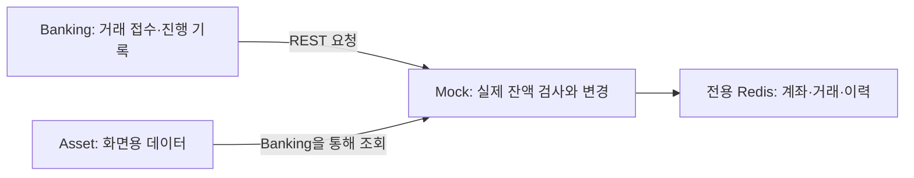
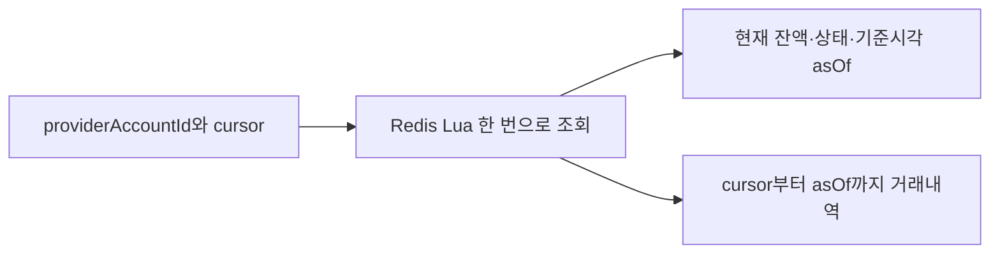

# Mock Banking: 실습용 은행의 원본 기록

저장소 이름은 **`backing-mockup`**입니다. 대화에서 사용한 moaje-mockup·mock-server는 이 프로젝트를 뜻합니다. 모아제 실습 환경에서는 **이 서버의 잔액과 거래 결과가 기준**입니다. 실제 은행 수준의 원장 보존·정산 시스템을 구현한 것은 아닙니다.

## 1. Banking과 역할이 어떻게 다른가요?



Banking DB가 성공이라고 쓰는 것만으로 돈이 이동하지 않습니다. Mock이 출금계좌를 차감하고 수취계좌를 증가시켜야 실제 송금이 됩니다. Asset이 고장 나도 이 결과는 바뀌지 않습니다.

Mock은 Java 21·Spring Boot 3.3.6·Kotlin·Redis를 사용합니다. MySQL과 Flyway는 없습니다. 전용 Redis는 Compose 내부 `mock-banking-redis:6379`, 호스트에서는 `127.0.0.1:6380`입니다. infra Redis와 같은 저장소가 아닙니다.

## 2. 계좌와 송금을 처리하는 순서

### Step 1. 계좌를 만듭니다

`AccountService.register()`는 같은 소유 CI·은행코드·상품의 활성 계좌가 있으면 반환합니다. 없으면 불투명한 UUID `providerAccountId`와 숫자형 계좌번호를 생성합니다. Banking은 providerAccountId를 저장하고, 실제 계좌번호 해석은 Mock 내부에서 합니다.

소유자 조회 후 생성하는 단계가 하나의 원자 연산은 아니므로 **동시 계좌 개설을 한 건으로 보장하는 설계는 아닙니다.** 계좌 해지는 물리 삭제가 아니라 CANCELED 상태 변경입니다.

코드: [AccountService](/C:/moaje/backing-mockup/src/main/kotlin/com/example/bankingmockup/account/application/AccountService.kt).

### Step 2. 송금 전 계좌와 금액을 검사합니다

`TransferService`가 `fromProviderAccountId`를 실제 출금계좌로 해석합니다. Repository의 Redis Lua 스크립트가 중복 clientTransferId, 양쪽 계좌 존재·활성 상태, 출금 잔액을 확인합니다.

```text
clientTransferId 중복 확인
→ 계좌·잔액 검사
→ 출금 -금액, 입금 +금액
→ 양쪽 거래내역과 원거래 결과 저장
```

Lua는 Redis 안에서 실행하는 작은 프로그램입니다. 여러 잔액 변경 사이에 다른 명령이 끼어들지 않게 묶습니다. 같은 clientTransferId가 이미 있으면 다시 차감하지 않습니다. **현재 중복 요청에 이전 성공 응답을 그대로 돌려주는 것은 아니며 중복 예외를 냅니다.** 사용자 재요청에 기존 결과를 반환하는 역할은 Banking에 있습니다.

코드: [TransferService](/C:/moaje/backing-mockup/src/main/kotlin/com/example/bankingmockup/transfer/application/TransferService.kt), [RedisTransferRepository.TRANSFER_SCRIPT](/C:/moaje/backing-mockup/src/main/kotlin/com/example/bankingmockup/transfer/infrastructure/RedisTransferRepository.kt).

Lua의 원자 실행은 SQL 트랜잭션의 모든 보장과 같지 않습니다. 스크립트 중간의 데이터 타입 오류·용량 문제에 대한 되돌리기, 디스크 유실, 장애 후 복구까지 자동으로 보장하지 않습니다. AOF 저장과 noeviction은 보호 수단일 뿐 금융 원장 백업 정책을 대신하지 않습니다.

### Step 3. 나중에 같은 거래 결과를 조회합니다

`GET /api/transfers/{clientTransferId}`는 Redis 원거래 기록을 조회합니다. Banking의 transferId와 같은 값입니다. 응답 상태는 SUCCEEDED 또는 REVERSED이며, 없으면 404입니다. 조회 응답의 fromBalance/toBalance는 별도로 읽은 현재 잔액이므로 원 송금 직후 잔액으로 해석하지 않습니다.

**주의할 미완료 부분:** 현재 Repository는 레코드 필수 필드가 빠진 손상 데이터도 null로 반환할 수 있습니다. 따라서 “404는 반드시 원 요청이 없다는 뜻”이라는 목표 계약을 모든 경우에 충족하지 않습니다. 손상·삭제·아직 실행 가능한 지연 요청과 실제 부재를 구별하는 보강이 필요합니다. Banking이 NOT_FOUND를 FAILED로 확정하는 정책과 함께 검토해야 합니다.

## 3. 스냅샷으로 외부 거래를 찾아 줍니다



1. Asset이 마지막으로 읽은 위치인 cursor를 Banking에 보냅니다.
2. Mock은 Redis 서버 시각으로 asOf를 정합니다.
3. 같은 Lua 실행 안에서 계좌 잔액·상태·해당 구간 이력을 읽습니다. 서로 다른 시점의 잔액과 이력을 섞지 않기 위해서입니다.
4. Controller가 실제 계좌번호와 상대 계좌번호를 응답 이력에서 제거합니다.

거래의 `createdAt`은 최초 발생 시각으로 유지합니다. Redis 이력 정렬 값과 `completedAtEpochMillis`에는 실제 반영 시점의 Redis TIME을 씁니다. 오래 기다린 송금이 나중에 실행돼도 이미 지나간 조회 구간에 숨어 버리지 않게 하기 위해서입니다. 같은 밀리초의 경계는 포함해서 조회하고 Asset에서 외부 거래 ID로 중복을 제거합니다.

코드: [RedisAccountRepository.findSnapshotByProviderAccountId](/C:/moaje/backing-mockup/src/main/kotlin/com/example/bankingmockup/account/infrastructure/RedisAccountRepository.kt). 이력은 아직 페이지로 나누지 않습니다. 장기 시계 역행·이력 삭제·대용량 응답까지 해결한 것은 아닙니다.

## 4. REST 규격

기본 URL은 `http://localhost:8081`입니다. 모든 금액은 정수 Long이며 0보다 커야 합니다. 계좌 초기 잔액만 0도 허용합니다. ISO-8601 시각과 Epoch 밀리초 필드를 구별하세요.

| API | 주요 입력 | 반환 |
|---|---|---|
| POST `/oauth/2.0/token` | ci 필수; userName/phoneNumber 선택 | accessToken, tokenType=Bearer, expiresIn |
| POST `/api/accounts` | bankCode, productName, initialBalance | 200. providerAccountId, accountNumber, bankCode, productName, balance, status, createdAt, canceledAt |
| GET `/api/accounts/{accountNumber}` | 계좌번호 | 위 계좌 응답 |
| DELETE `/api/accounts/{accountNumber}` | 계좌번호 | CANCELED 계좌 응답 |
| GET `/api/accounts/{accountNumber}/histories` | 계좌번호 | transactionId, type, amount, 상대 정보, memo, createdAt, 선택 완료 시각 목록 |
| POST `/api/accounts/{accountNumber}/withdrawals` | amount, 선택 memo | 출금 후 계좌 응답 |
| POST `/api/transfers` | clientTransferId, fromProviderAccountId, toAccountNumber, amount, 선택 memo | 양쪽 잔액과 debitHistory/creditHistory, clientTransferId |
| GET `/api/transfers/{clientTransferId}` | Banking transferId와 같은 문자열 | 상태·원거래 ID·선택 반전 ID/시각; 부재 404 |
| POST `/api/transfers/{clientTransferId}/reverse` | 원거래 ID | 보상 결과. 실습용 기존 API이며 Banking은 호출하지 않음 |
| GET `/api/accounts/providers/{providerAccountId}/snapshot?cursor=...` | cursor: ISO Instant, 기본 EPOCH | providerAccountId, balance, status, asOf, 계좌번호를 제거한 histories |

계약 원본: [AccountController의 DTO](/C:/moaje/backing-mockup/src/main/kotlin/com/example/bankingmockup/account/presentation/AccountController.kt), [TransferController의 DTO](/C:/moaje/backing-mockup/src/main/kotlin/com/example/bankingmockup/transfer/presentation/TransferController.kt). 이전 문서의 fromAccountNumber 요청·UUID 계좌번호·계좌 생성 201 설명은 현재 규격이 아닙니다.

### Mock 토큰과 JWT는 다릅니다

`/oauth/2.0/token`의 임의 문자열 토큰은 **Mock 연동용**입니다. Auth가 앱에 발급하는 JWT가 아닙니다. 실제 TTL은 [AuthTokenService.TOKEN_TTL](/C:/moaje/backing-mockup/src/main/kotlin/com/example/bankingmockup/auth/application/AuthTokenService.kt)의 **30일**입니다. 일부 예전 주석의 30분과 다릅니다.

`/api/**`에는 이 토큰의 Bearer 헤더와 `X-Signature`가 필요합니다. 서명은 `HMAC-SHA256(공유키, 실제 전송한 UTF-8 본문)`의 소문자 hex입니다. HMAC은 공유키를 아는 호출자가 만든 본문인지 검사하는 값입니다. Body가 없는 GET/DELETE는 빈 바이트열을 서명합니다. 공백·필드 순서를 바꾼 JSON을 보내면 서명도 다시 만들어야 합니다. 요청 본문 제한은 10,240바이트입니다.

실행 예제는 [compose-smoke.ps1](/C:/moaje/moaje-infra/tests/compose-smoke.ps1)의 `Mock-Request`에 있습니다. 개인 토큰·실제 계좌번호·비밀키를 문서에 복사하지 않고 실행 중 생성한 테스트 데이터로 호출하도록 구성했습니다.

## 5. 오류·장애 테스트와 실행

인증·서명이 잘못되면 401, 계좌 없음 404, 비즈니스 검증 실패는 주로 400입니다. Interceptor 오류와 비즈니스 예외의 JSON 형식이 같지는 않습니다. 상세 코드는 [AccountExceptionHandler](/C:/moaje/backing-mockup/src/main/kotlin/com/example/bankingmockup/account/presentation/AccountExceptionHandler.kt)를 확인하세요.

인증을 통과한 요청에 `X-Mock-Scenario`를 붙이면 다음을 주입합니다.

| 값 | 실제 동작 |
|---|---|
| TIMEOUT_ERROR | 기본 5초 지연 후 계속 처리. Banking readTimeout 30초를 기본값 그대로 넘기지는 않음 |
| INTERNAL_SERVER_ERROR | 500 |
| CONCURRENCY_CONFLICT | 409 |
| ACCOUNT_FROZEN | 403 |

```powershell
# C:\moaje\backing-mockup
docker compose up -d --build
$env:MOCK_REDIS_TEST_PORT = '6380'
.\gradlew.bat redisIntegrationTest --rerun
docker compose stop
```

Redis 통합 테스트는 무작위 키만 사용·정리하며 FLUSHDB를 쓰지 않습니다. 일반 `test`와 별도 태그로 구분됩니다. [실행 결과](../phase-history-and-retrospective.md#verification)는 단위 테스트와 Docker 검증을 나눠 기록합니다.

운영 수준으로 남은 것: 계좌 개설·출금의 멱등성, Mock API별 소유권/서비스 권한 강화, HMAC의 경로·메서드/재전송 보호, 데이터 손상 구분, Redis 원장 보존·백업, 금액 범위와 Lua 정밀도 검증. 반전 API의 존재는 모아제의 보상 업무 정책이 확정됐다는 뜻이 아닙니다.
